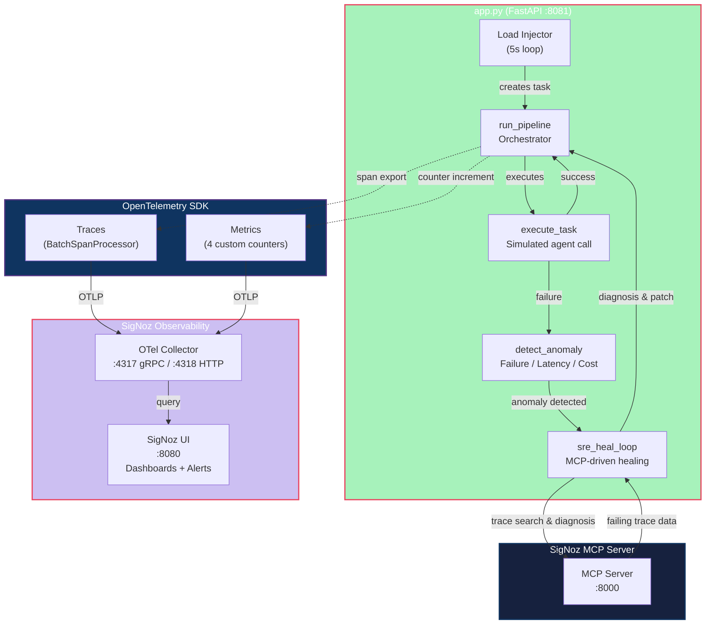

# Self-Healing SRE Agent Pipeline — SigNoz Monitoring

An AI-powered, self-healing agent pipeline instrumented with **OpenTelemetry** and monitored by **SigNoz**. Built as a single-file FastAPI application (`app.py`) — production-grade, fully typed, and immediately runnable.

> 🏆 **Hackathon Project** — Autonomous SRE Pipeline with Real-Time ROI Observability

---

## Table of Contents

- [The Self-Healing Concept](#the-self-healing-concept)
- [Architecture](#architecture)
- [Installation Setup Process](#installation-setup-process)
- [Running the Application](#running-the-application)
- [Endpoints](#endpoints)
- [Environment Variables](#environment-variables)
- [OpenTelemetry Metrics](#opentelemetry-metrics)
- [SigNoz Dashboard](#signoz-dashboard)
- [SigNoz Alert Rule](#signoz-alert-rule)
- [Verifying Telemetry](#verifying-telemetry)
- [Project Structure](#project-structure)
- [Code Quality](#code-quality)

---

## The Self-Healing Concept

This pipeline simulates an autonomous SRE (Site Reliability Engineering) agent that:

1. **Executes tasks** — runs synthetic agent calls with configurable LLM-like failures (default 30%).
2. **Detects anomalies** — flags failed tasks, high latency (>2 s), or excessive token cost (>10).
3. **Heals itself** — connects to a SigNoz MCP (Model Context Protocol) server, fetches failing trace data, diagnoses the root cause, and generates a code patch. Falls back gracefully if MCP is unreachable.
4. **Reports metrics** — all steps are traced via OpenTelemetry and exported to SigNoz with 4 custom counters tracking executions, errors, healing interventions, and cumulative ROI.

A **background load injector** continuously submits synthetic tasks every 5 seconds, guaranteeing a hot stream of traces and metrics in SigNoz for live dashboards and alerting.

---

## Architecture



### Pipeline Flow

1. **Background Load Injector** creates a synthetic task every 5 seconds
2. **`run_pipeline`** orchestrates the execution → calls `execute_task`
3. **`execute_task`** simulates an agent call with a configurable failure rate (default 30%)
4. On **success** → metrics counters are incremented, pipeline returns
5. On **failure** → `detect_anomaly` checks if healing is needed (failure, high latency, or high cost)
6. **Anomaly found** → `sre_heal_loop` queries the SigNoz MCP Server for trace diagnosis
7. **MCP Server** returns root-cause diagnosis + auto-generated code patch
8. **Fallback** — if the MCP server is unreachable, a local fallback healing action is used
9. **All 4 metric counters** (`pipeline_tasks_total`, `pipeline_task_errors_total`, `pipeline_heals_total`, `pipeline_money_saved_total`) are exported via OTLP to SigNoz

### Network Topology

| Component | Host Port | Purpose |
|-----------|-----------|---------|
| **Python app** | `:8081` | FastAPI endpoints (`/health`, `/pipeline/run`, `/pipeline/stats`) |
| **SigNoz UI** | `:8080` | Dashboard + trace/metrics explorer + alert management |
| **OTLP gRPC** | `:4317` | Where the app exports traces and metrics |
| **OTLP HTTP** | `:4318` | Alternative OTLP ingest |
| **MCP Server** | `:8000` | MCP HTTP API (Docker container) |

> **Note on port 8081:** The app uses `:8081` to avoid conflict with the SigNoz frontend (`:8080`) and the MCP server (`:8000`). Set `APP_PORT` to override.

---

## Installation Setup Process

### Prerequisites

| Tool | Version | Purpose |
|------|---------|---------|
| Python | 3.11+ | Application runtime |
| Docker Desktop | latest | SigNoz stack (WSL2 backend on Windows) |
| Git | latest | Clone Foundry / SigNoz repos |
| Chrome | latest | SigNoz UI dashboard access |

### Option A: Automatic Setup (Recommended)

Use the provided `setup_stack.sh` script (Linux/macOS/WSL2):

```bash
# 1. Make the script executable
chmod +x setup_stack.sh

# 2. Run the full automated installer
./setup_stack.sh
```

The script handles everything:
1. **Installs Foundry CLI** (`foundryctl`) — SigNoz's official deployment tool, if not already present
2. **Generates deployment config** via `foundryctl forge -f casting.yaml` — produces `pours/deployment/compose.yaml`
3. **Dynamically injects MCP Server** — reads the generated compose, auto-detects service names, creates a correct `docker-compose.override.yaml` with OTLP port exposure (`:4317`, `:4318`) and the `signoz-mcp-server` container
4. **Deploys the stack** via `docker compose -f compose.yaml -f docker-compose.override.yaml up -d`
5. **Waits for health** — polls SigNoz API at `:8080` until healthy (up to 5 minutes on first boot)
6. **Creates a Python virtual environment** (auto-installs `python3-venv` if missing) and installs dependencies
7. **Launches the pipeline application** at `http://localhost:8081`

### Option B: Foundry (SigNoz Local Dev Tool)

The project includes `casting.yaml` and `casting.yaml.lock` for **Foundry**, SigNoz's local deployment tool:

```bash
# Install Foundry (if not already installed)
# See https://signoz.io/docs/install/foundry/

# Deploy the stack from the lock file
foundryctl cast -f casting.yaml.lock
```

### Option C: Manual Step-by-Step Setup

> ⚠️ **Windows CRLF Warning** — If you edit `setup_stack.sh` or any shell scripts on Windows, editors may save them with Windows line endings (`\r\n` / CRLF) instead of Unix line endings (`\n` / LF). This will cause errors like:
> ```
> env: $'bash\r': No such file or directory
> env: use -[v]S to pass options in shebang lines
> ```
>
> **To fix it**, run this from WSL or any Linux environment:
> ```bash
> sed -i 's/\r$//' setup_stack.sh
> ```
>
> Or use `dos2unix` if installed:
> ```bash
> dos2unix setup_stack.sh
> ```
>
> **To prevent it**, configure git to handle line endings automatically:
> ```bash
> git config core.autocrlf input
> ```
> Or configure your editor to save shell scripts with **LF** (Unix) line endings.

#### Step 1 — Clone & Start SigNoz

```bash
# Clone the official SigNoz repository
git clone -b main https://github.com/sigNoz/signoz.git

# Copy the Docker Compose override (WSL2 networking + MCP server)
cp docker-compose.override.yaml signoz/deploy/

# Start the SigNoz stack
cd signoz/deploy
docker compose up -d
```

#### Step 2 — Wait for SigNoz to be healthy

```bash
# Poll the SigNoz Query Service until it returns HTTP 200
until curl -s -o /dev/null -w "%{http_code}" http://localhost:3301 | grep -q 200; do
  echo "Waiting for SigNoz... (5s)"
  sleep 5
done
echo "SigNoz is ready!"
```

This typically takes 60–180 seconds on first boot (database migrations).

#### Step 3 — Create Python virtual environment

```bash
# From the project root
python3 -m venv venv
source venv/bin/activate     # Linux/macOS/WSL2
# OR on Windows PowerShell:
# .\venv\Scripts\Activate.ps1

pip install --upgrade pip
pip install -r requirements.txt
```

#### Step 4 — Set environment variables

```bash
# Linux/macOS/WSL2
export OTEL_SERVICE_NAME="self-healing-sre-pipeline"
export OTEL_EXPORTER_OTLP_ENDPOINT="http://localhost:4317"
export APP_PORT=8081
export PIPELINE_FAILURE_RATE=0.30
```

```powershell
# Windows PowerShell
$env:OTEL_SERVICE_NAME = "self-healing-sre-pipeline"
$env:OTEL_EXPORTER_OTLP_ENDPOINT = "http://localhost:4317"
$env:APP_PORT = 8081
$env:PIPELINE_FAILURE_RATE = "0.30"
```

#### Step 5 — Run the application

```bash
python app.py
```

You should see:
```
INFO:     Started server process [12345]
INFO:     Waiting for application startup.
INFO:     Background load injector started.
INFO:     Application startup complete.
INFO:     Uvicorn running on http://0.0.0.0:8081
```

---

## Running the Application

### Quick Start (after initial setup)

```bash
# Activate venv and run
source venv/bin/activate        # Linux/macOS
.\venv\Scripts\Activate.ps1     # Windows PowerShell

$env:APP_PORT = 8081
python app.py
```

### Controlling the Failure Rate

The app simulates failures at a configurable rate via the `PIPELINE_FAILURE_RATE` env var:

```powershell
# 30% failure rate (default) — good for demo with alerting
$env:PIPELINE_FAILURE_RATE = "0.30"

# 15% failure rate — original baseline
$env:PIPELINE_FAILURE_RATE = "0.15"

# 50% failure rate — stress test healing
$env:PIPELINE_FAILURE_RATE = "0.50"
```

---

## Endpoints

| Method | Path | Description |
|--------|------|-------------|
| `GET` | `/health` | Health check — returns `{"status": "ok", "service": "..."}` |
| `POST` | `/pipeline/run` | Execute one pipeline task and return summary |
| `GET` | `/pipeline/stats` | In-memory counters (total, success, fail, heal, cost) |

### Example: Run a pipeline task

```powershell
# Windows PowerShell
$body = '{
  "task_id": "demo-001",
  "prompt": "Analyse production error logs",
  "target_service": "self-healing-sre-pipeline",
  "max_budget": 50.0
}'
Invoke-RestMethod http://localhost:8081/pipeline/run -Method Post -Body $body -ContentType "application/json"
```

```bash
# Linux / WSL2
curl -X POST http://localhost:8081/pipeline/run \
  -H "Content-Type: application/json" \
  -d '{
    "task_id": "demo-001",
    "prompt": "Analyse production error logs",
    "target_service": "self-healing-sre-pipeline",
    "max_budget": 50.0
  }'
```

Example response:
```json
{
  "task_id": "demo-001",
  "success": false,
  "healing_applied": true,
  "total_cost": 9.9406,
  "total_latency_ms": 453.0
}
```

### View stats

```powershell
Invoke-RestMethod http://localhost:8081/pipeline/stats -Method Get
```

```bash
curl http://localhost:8081/pipeline/stats
```

Example response:
```json
{
  "total_tasks": 11,
  "successful": 9,
  "failed": 2,
  "healed": 0,
  "total_token_cost": 79.6837
}
```

---

## Environment Variables

| Variable | Default | Description |
|----------|---------|-------------|
| `OTEL_SERVICE_NAME` | `self-healing-sre-pipeline` | Service identity in SigNoz traces/metrics |
| `OTEL_EXPORTER_OTLP_ENDPOINT` | `http://localhost:4317` | OTLP gRPC endpoint for trace/metric export |
| `APP_PORT` | `8081` | Port for the FastAPI application |
| `PIPELINE_FAILURE_RATE` | `0.30` | Probability (0.0–1.0) of task failure |

---

## OpenTelemetry Metrics

The application emits **4 custom counters** via the OTel Metrics SDK:

| Metric | Type | Description | Incremented When |
|--------|------|-------------|-----------------|
| `pipeline_tasks_total` | Counter | Total task executions | Every `run_pipeline()` call |
| `pipeline_task_errors_total` | Counter | Failed task executions | Task completes with `success: false` |
| `pipeline_heals_total` | Counter | Successful healing interventions | Healing loop returns `applied: true` |
| `pipeline_money_saved_total` | Counter | Cumulative ROI (USD) | Successful task (by token cost) + healing event |

These metrics are exported to SigNoz every 60 seconds via `PeriodicExportingMetricReader` and can be queried in the SigNoz **Metrics** explorer or used in **Dashboards** and **Alerts**.

Each span also carries custom attributes:

| Attribute | Type | Description |
|-----------|------|-------------|
| `agent.persona` | string | Pipeline stage (`task_runner`, `error_detector`, `sre_analyst`, `code_healer`, `load_injector`) |
| `token.cost.accumulated` | float | Simulated cumulative token cost |
| `dread.level` | int | Panic level (0 = success, 7–10 = critical failure) |

---

## SigNoz Dashboard

A pre-built SigNoz dashboard JSON (`signoz-pipeline-roi-dashboard-v2.json`) is included in the project root.

### Importing the Dashboard

1. Open **http://localhost:8080/dashboards** in Chrome
2. Click **Import JSON** (top-right corner)
3. Upload `signoz-pipeline-roi-dashboard-v2.json` or paste its contents
4. Click **Save**

### Dashboard Panels

| Panel | Type | Metric |
|-------|------|--------|
| **Total Pipeline Executions** | Big Number (Value) | `pipeline_tasks_total` |
| **Automated Healing Interventions** | Big Number (Value) | `pipeline_heals_total` |
| **Total Revenue Saved ($)** | Big Number (Value) | `pipeline_money_saved_total` |
| **Revenue Saved Over Time** | Time Series (Graph) | All 3 metrics overlaid |

> The dashboard uses SigNoz V5 JSON format. After importing, wait ~60 seconds for the background load injector to populate data before the panels show values.

---

## SigNoz Alert Rule

To demonstrate proactive monitoring, create an alert that fires when the pipeline error rate exceeds 20%.

### Steps (in SigNoz UI)

1. Open **http://localhost:8080/alerts** → click **New Alert**
2. **Query A**: Metric = `pipeline_task_errors_total`, Aggregation = `Sum`
3. **Query B**: Metric = `pipeline_tasks_total`, Aggregation = `Sum` (click "+ Add Query")
4. **Formula C**: `B / A * 100` (click "+ Add Formula")
5. **Condition**: `Above 20` on Formula C, `on average` over `5m`
6. **Labels**: `severity: critical`, `service: self-healing-sre-pipeline`
7. **Save & Enable**

### Triggering the Alert

The default 30% failure rate means the error rate naturally hovers above 20%. Wait ~5 minutes after starting the app, or fire a batch of rapid tasks:

```powershell
# Run 20 concurrent tasks to speed up data generation
python -c "
import asyncio, httpx
async def f():
    async with httpx.AsyncClient(timeout=15.0) as c:
        results = await asyncio.gather(*[c.post('http://localhost:8081/pipeline/run',
            json={'task_id':f'alert-{i:03d}','prompt':'Alert test','target_service':'self-healing-sre-pipeline','max_budget':50.0})
            for i in range(20)])
        succ = sum(1 for r in results if r.json().get('success'))
        fail = sum(1 for r in results if not r.json().get('success'))
        print(f'{succ} success, {fail} failed (rate: {fail/20*100:.1f}%)')
asyncio.run(f())
"
```

---

## Verifying Telemetry

### 1. Check the app is running

```powershell
Invoke-RestMethod http://localhost:8081/health -Method Get
# Returns: {"status": "ok", "service": "self-healing-sre-pipeline"}
```

### 2. Check pipeline statistics

```powershell
Invoke-RestMethod http://localhost:8081/pipeline/stats -Method Get
```

### 3. View traces in SigNoz

1. Open **http://localhost:8080** → navigate to **Traces**
2. Search for service `self-healing-sre-pipeline`
3. Filter by `agent.persona` to see spans from specific pipeline stages

### 4. View metrics in SigNoz

1. Open **http://localhost:8080** → navigate to **Metrics**
2. Search for `pipeline_tasks_total`, `pipeline_task_errors_total`, `pipeline_heals_total`, or `pipeline_money_saved_total`
3. Select **Sum** aggregation to see cumulative values

### 5. Check the dashboard

1. Open **http://localhost:8080/dashboards**
2. Select **"Self-Healing Pipeline ROI Engine"**
3. The 4 panels should populate within 60 seconds

---

## Project Structure

```
.
├── app.py                              # Single-file FastAPI application (all logic)
├── requirements.txt                    # Python dependencies with version pins
├── README.md                           # This file
├── .gitignore                          # Git exclusion rules
│
├── docker-compose.override.yaml        # Docker Compose override (reference — dynamically generated by setup_stack.sh)
├── setup_stack.sh                      # Bash automation script (full stack setup)
│
├── casting.yaml                        # Foundry deployment config (for SigNoz reproduction)
├── casting.yaml.lock                   # Foundry lock file (pinned service topology)
│
├── signoz-pipeline-roi-dashboard-v2.json  # Pre-built SigNoz dashboard (V5 format)
│
├── pours/                              # Foundry output directory (gitignored, generated by setup_stack.sh)
│   └── deployment/
│       ├── compose.yaml                #   Generated Docker Compose file
│       └── docker-compose.override.yaml #   Dynamic MCP Server + port override
```

## Code Quality

- **Linted** with `ruff` — no warnings
- **Type-checked** with `mypy --strict` — no errors
- **No deprecated OTel methods** — uses canonical import paths
- **All spans properly closed** via context managers (`with`)
- **No recursion** — the healing loop is iterative
- **No subprocess calls** — everything runs in-process
- **Fully typed** — every function has complete type annotations
- **Structured logging** — uses Python `logging` module, no `print()` statements
